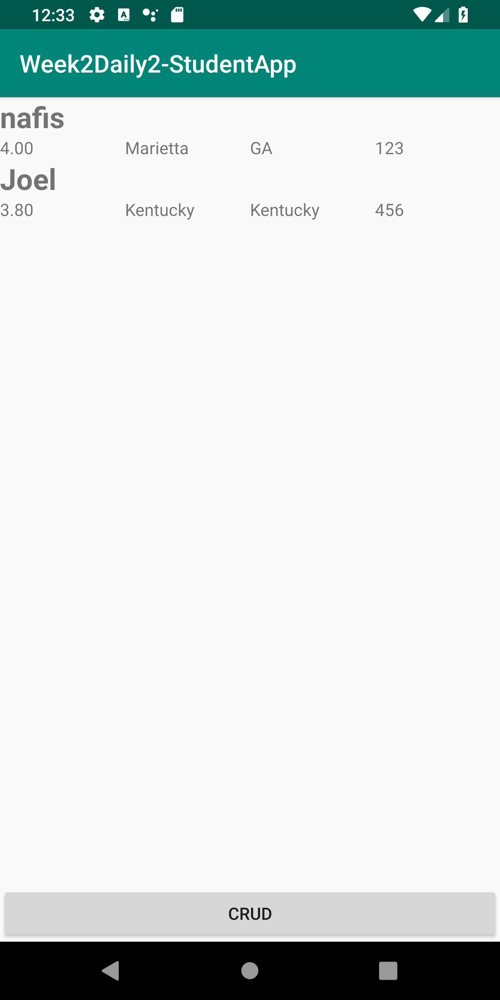
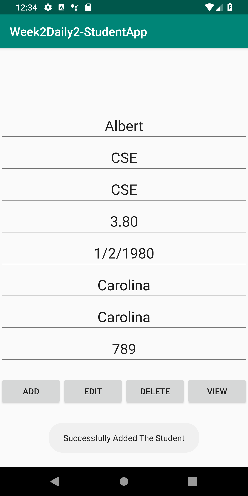
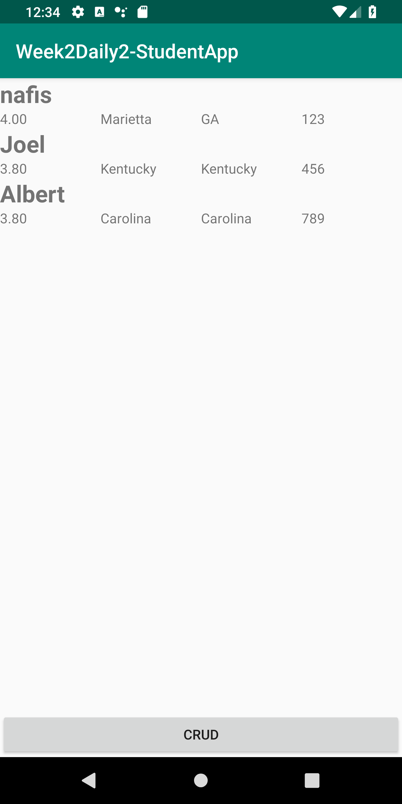
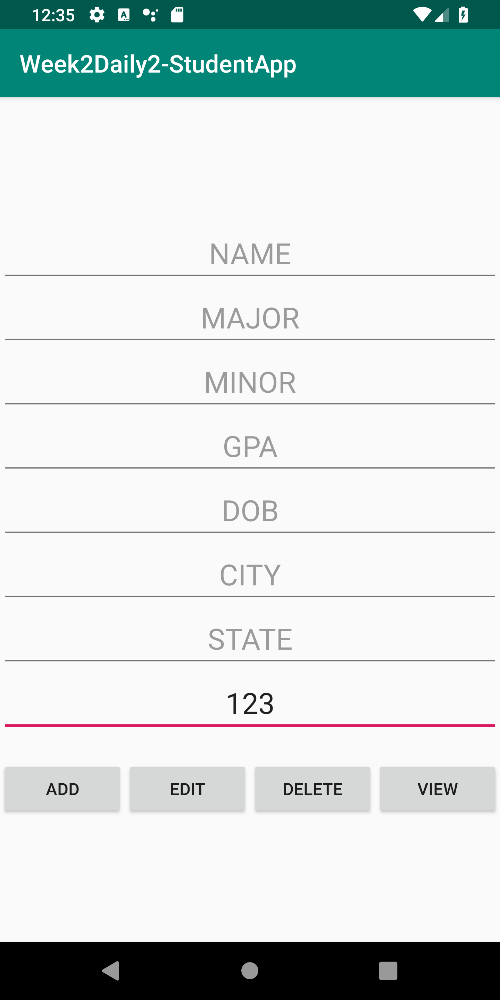
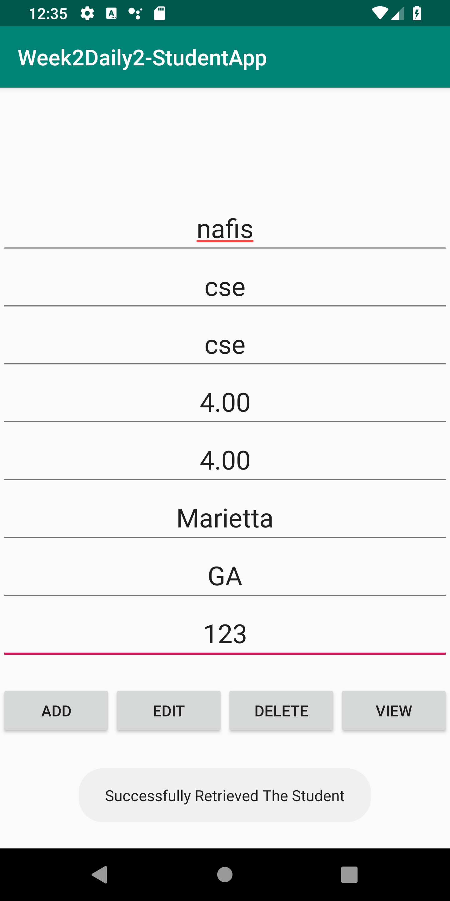
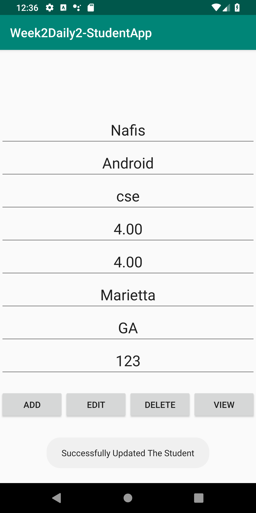
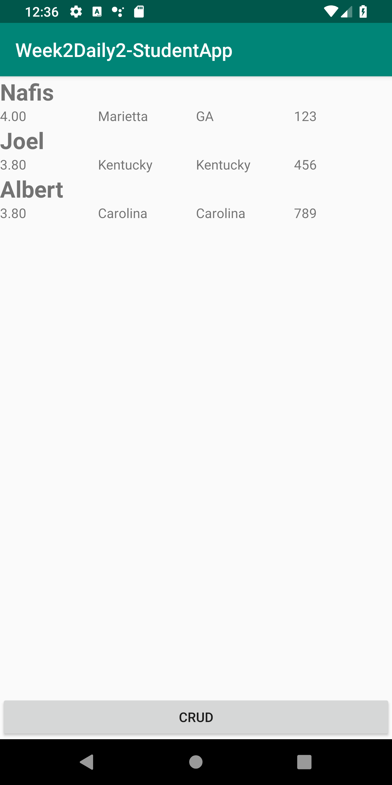
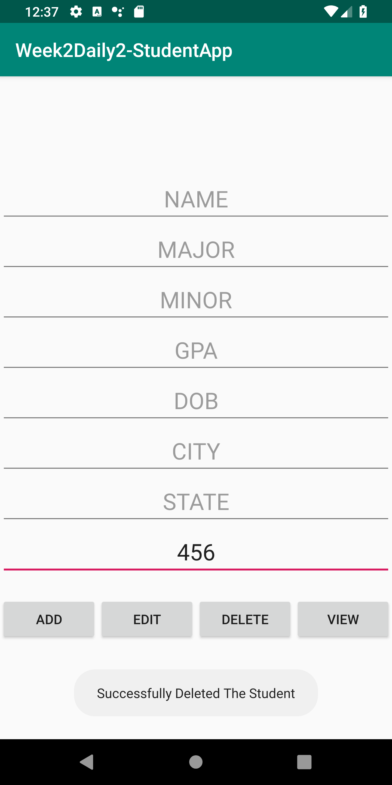
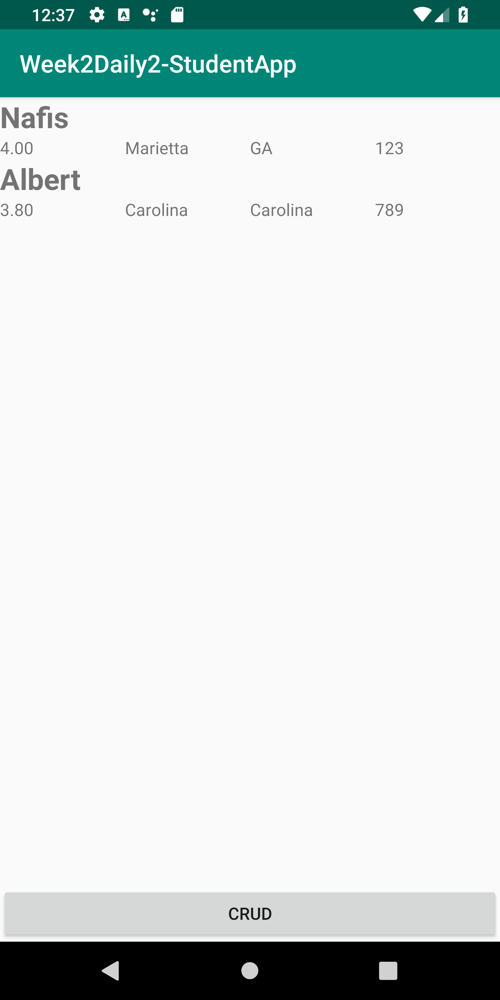

# Week2Daily2StudentApp
Week 2 Day 2 Student Application to do basic CRUD operations and show them all in a recyclerCView

This is main activity with some data.

Successfully added new student information to database.

New student information in RecyclerView.

Going to Retrive a student information by his/ her ssn.

Successfully retrieved the information of student.

Successfully updated to database. Changed the Name, Major and Minor.

Successfully updated in RecyclerView.

Deleted a student using ssn.

Removed from the RecyclerView.

